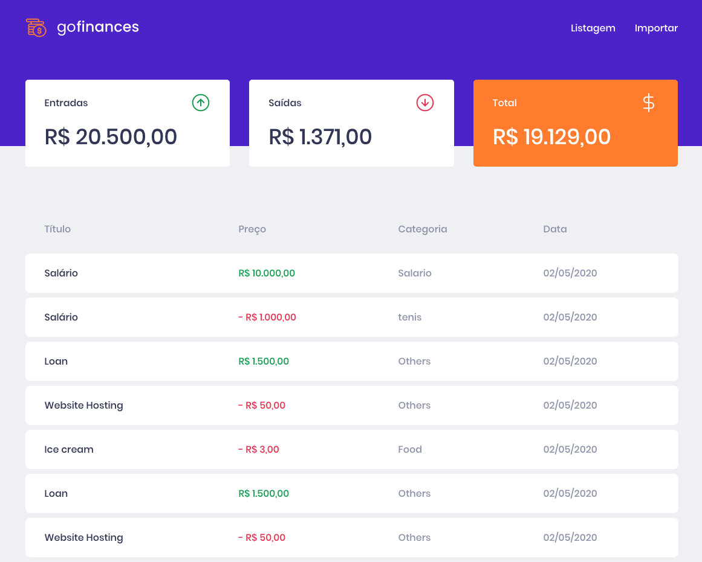
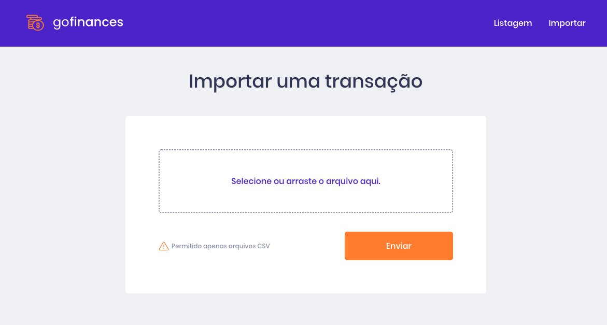

## 💰 GoFinances

Aplicação desenvolvida no desafio de React JS do Bootcamp GoStack desenvolvida pela [Rocketseat](https://rocketseat.com.br).

## Listagem de registros



## Upload arquivo CSV


# Como executar

```
git clone https://github.com/nicolastanski/desafio-fundamentos-reactjs.git
cd desafio-fundamentos-reactjs
yarn install
yarn start
```

# 📝 Licença

Esse projeto está sob a licença MIT.

---
Codado com 💙 e muito ☕️ por Nicolas Tanski
